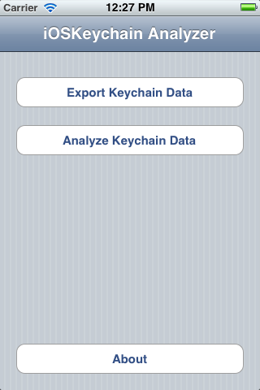
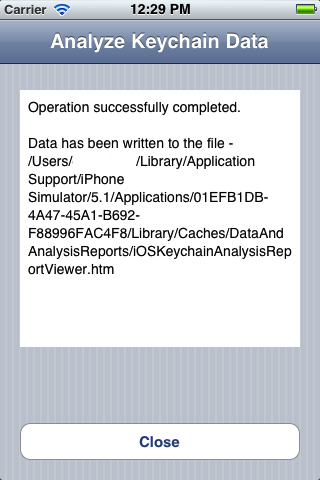
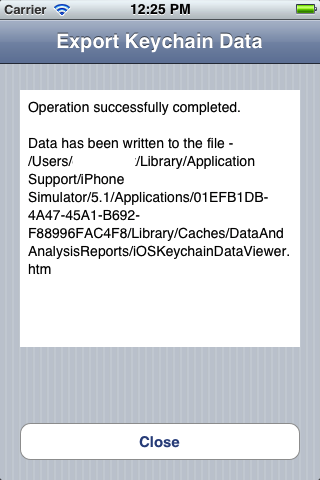
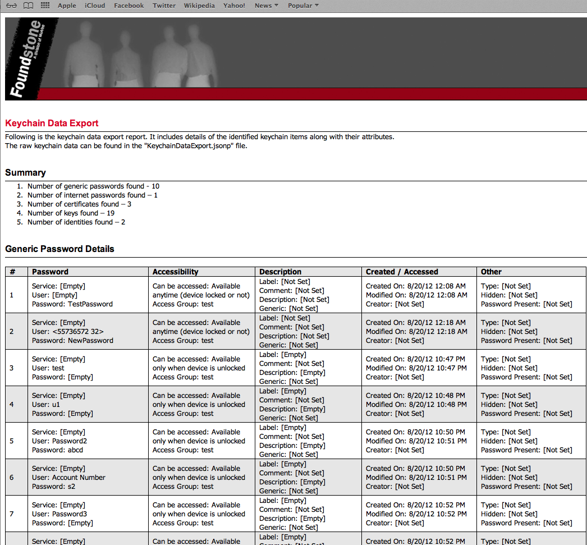
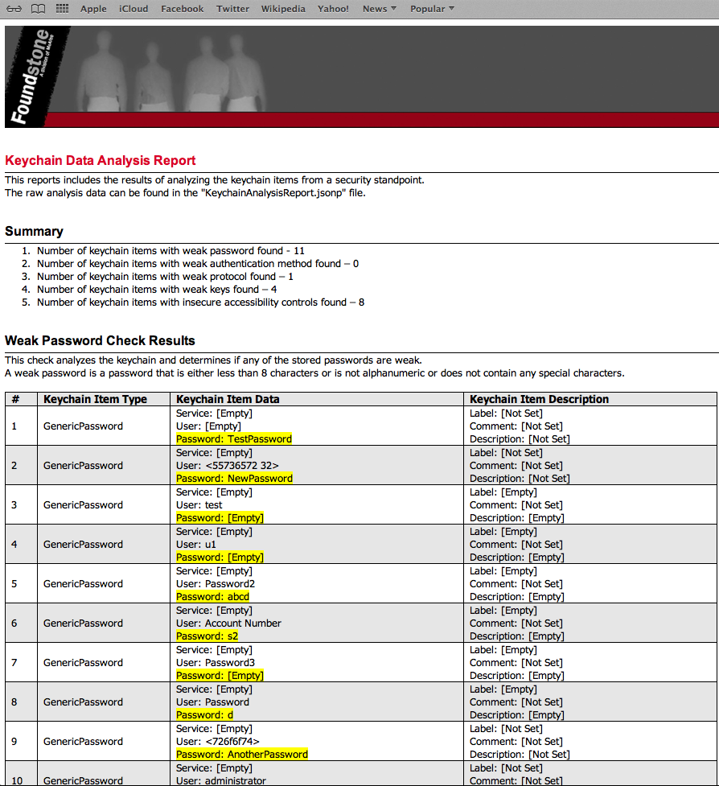
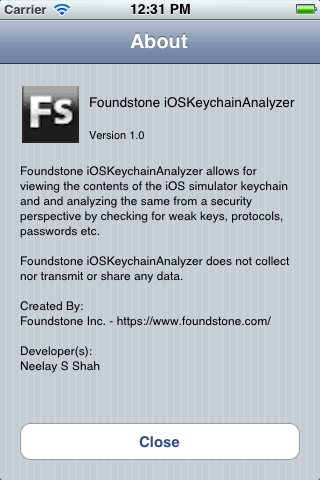

# Foundstone iOSKeychain Analyzer

## Overview and Description
Foundstone iOSKeychain Analyzer accomplishes the following two main functionalities -

1. Extract and export iOS simulator keychain contents
2. Analyze the iOS simulator keychain contents from a security standpoint

The tool is intended for penetration testers as they test iOS application within the iOS simulator. Often the application will use the iOS keychain and from a testing standpoint it is necessary to inspect the contents of the keychain. The tool allows viewing the contents of the iOS "keychain" to identify the secrets being stored as well as analyzes these secrets from a security standpoint.

### Usage
1. First install and configure the application that you are testing within the iOS simulator. 
2. If iOS Keychain Analyzer is not installed within the simulator then install it. See the "Installation / Pre-Requisites" section for instructions on how to install the tool. 
3. Launch the iOS Keychain Analyzer and export/analyze the keychain data. 
4. It should create the following two data export/report files in the application folder - /<iOS_Keychain_Analyzer_Installation_Folder>/Library/Caches/DataAndAnalysisReports. E.g. /Users/<User_Name>/Library/Application Support/iPhone Simulator/5.1/Applications/01EFB1DB-4A47-45A1-B692-F88996FAC4F8/Library/Caches/DataAndAnalysisReports/ 
	a. iOSKeychainDataViewer.htm - This report displays the entire contents of the keychain in a readable format. The raw keychain contents are stored in JSONP format in the "KeychainDataExport.jsonp" file
	b. iOSKeychainAnalysisReportViewer.htm - This report displays the keychain data analysis report in a readable format. The raw analysis report can be found in the "KeychainAnalysisReport.jsonp"

### Extract and Export iOS Simulator Keychain Contents
iOS exposes a secure storage "Keychain" which can be used by applications to securely store critical and security sensitive data such as symmetric keys, asymmetric private keys, certificates, username, passwords etc. As part of penetration testing iOS applications it is often necessary to be able to inspect the contents of this keychain to identify what the application is storing in the keychain and how it is potentially using the same. A common example is to use "Keychain" to store the login username and password so that the user is logged in seamlessly when the application is launched. The iOS simulator simulates this "Keychain" as a SQLite database.  However, this SQLite database is encrypted and as such opening it does not help much. 

iOSKeychain Analyzer extracts and exports the contents of the keychain along with the associated attributes/properties. The types of keychain items range from passwords, certificates to keys. The attributes for these keychain items include details such as clear text values, accessibility details, description/comments, creation/modification etc. 

### Analyze the iOS Simulator Keychain Contents from a Security Standpoint
The tool also analyzes the contents of iOS keychain from the perspective of the following checks -

1. Weak Password Check - All password items that have a length less than 8 characters, or is not alphanumeric or does not contain a special character is flagged
2. Weak Authentication Method Check - All password items that are configured to be used with weak authentication methods such as HTTP Basic and HTTP Digest are flagged
3. Weak Protocol Check - All passwords that are configured to use insecure protocols such as HTTP, FTP etc. are flagged
4. Weak Key Length Check - All symmetric keys with key length less than 128 bits and all asymmetric keys with key length less than 1024 bits are flagged
5. Insecure Accessibility Check - All items that can be accessed insecurely (irrespective of whether the device is locked or not) are flagged

## Installation / Pre-Requisites
The source code should compile successfully on Mac OS X 10.7.4/Xcode 4.4.1/iOS SDK 5.0. Once compiled, you can run it on an iOS 5.0/5.1 simulator. Though not tested, the code should compile and run fine on a more recent platform/environment than this. 

A compiled binary is provided for the iPhone 5.1 Simulator. To use this as is copy the "01EFB1DB-4A47-45A1-B692-F88996FAC4F8" to "/Users/<User_Name>/Library/Application Support/iPhone Simulator/5.1/Applications". Then launch iOS Simulator. Set the device to iPhone and version 5.1 and the application should appear installed on the simulator. You can then launch from there.

The data export/report files should open fine in Safari 6.0+, Firefox 17.0+ and Chrome 23.0.1271.101+

## Known Issues
The tool does not export the clear text public key or private key. The reason being the API exposes the opaque public/private key structure but not the actual bytes.


## Screenshots

#### Main Page 


#### Analyze Keychain Data Page


#### Export Keychain Data Page


#### Keychain Data Export Report


#### Keychain Analysis Report


#### About iOSKeychain Analyzer Page



 
